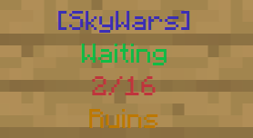
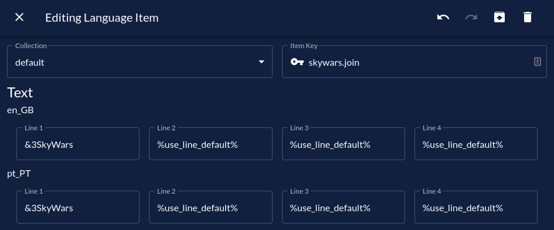
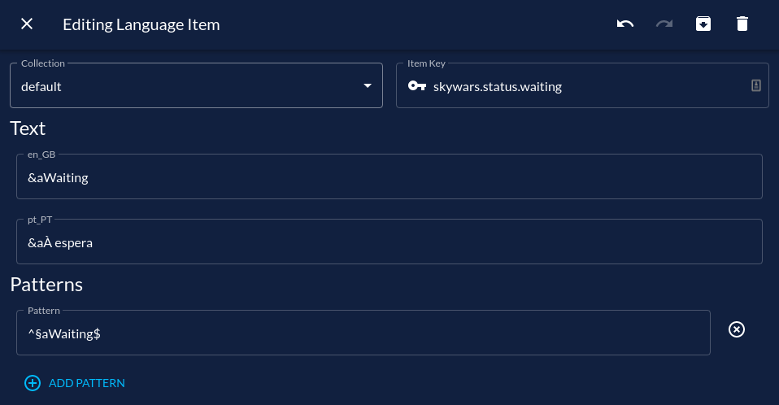

# Dynamic Signs

:::note[Requirements]
Requires Triton v2.3.0 or later.
:::

Until version 2.3.0, signs could only have static content. This means that signs that updated with dynamic information, like player count or status, couldn't be translated.  
Starting with 2.3.0, you can know turn off translation for specific lines, which allows for dynamic information.

To turn off the translation for a specific line, set it to `%use_line_default%` in the translation.  
These lines can also be combined with [patterns](./patterns.md) to allow for even more customization.

## Example

Let's suppose I have a game sign like the following:

I probably want to translate the game status and maybe change the content of the first line.
I could do that with the following syntax:

With this, I could then translate the game status with a pattern translation.
Unfortunately, this requires creating a pattern for every game status.

After this is done, the sign should work as expected.
