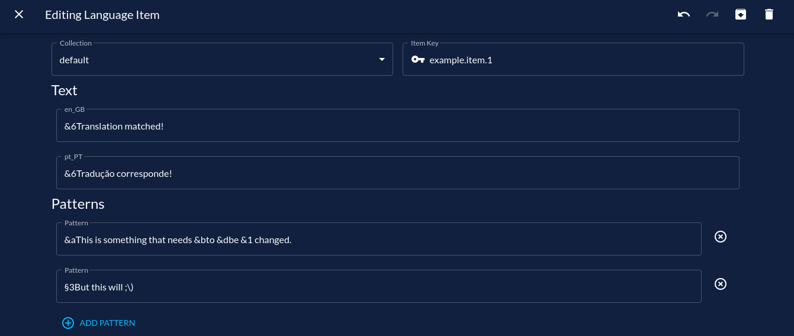

import Tabs from '@theme/Tabs';
import TabItem from '@theme/TabItem';

# Patterns

:::note[Requirements]
Triton v2.0.0 or later is required.
:::

This feature allows you to translate messages without using placeholders.

Sometimes plugins don't allow you to edit their messages, which means Triton wouldn't work.
For that reason, a feature was developed that allows you to translate **any** message, even if the plugin doesn't allow you to change it.  
This feature should work everywhere except scoreboards, which are not officially supported anymore.

## Using the feature

To get started, you just need to add `patterns` to any existing Translatable Item.

**Example:**

<Tabs groupId="translation-editor">
<TabItem value="twin" label="TWIN" default>

To add a pattern to TWIN, use the _Patterns_ section available in Translatable Items.



</TabItem>
<TabItem value="json" label="JSON" default>

```json
{
  "languages": {
    "en_GB": "&6Translation matched!",
    "pt_PT": "&6Tradução corresponde!"
  },
  "type": "text",
  "key": "example.item.1",
  "patterns": [
    "&aThis is something that needs &bto &dbe &1 changed.",
    "§3But this will ;\\)",
  ]
},
```

</TabItem>
</Tabs>

:::tip
Depending on the message and plugin, you may need to try both `&` and `§` to get the color code right.
:::

The example above will replace any `&aThis is something that needs &bto &dbe &1 changed.` and `§3But this will ;)` with `&6Translation matched!`.  
Notice that `)` in the latter needs to be escaped, since this is regex.
To make sure you're using valid regex, you can use a tool like [RegExr](https://regexr.com).

:::tip
To avoid people typing matching text in the chat, you can (and should) use the beginning (`^`)
and end (`$`) anchors in your patterns.
:::

:::danger[Performance Considerations]
Don't use patterns unless you really have to. Each pattern is checked against every message,
which can hit your server performance severely. Use Triton placeholders when possible.
:::

## Using variables

You can use regex groups to select variables and use them in the translated message.

**Example:**

<Tabs groupId="translation-editor">
<TabItem value="twin" label="TWIN" default>


</TabItem>
<TabItem value="json" label="JSON" default>

```json
{
  "languages": {
    "en_GB": "&aTranslation matched with placeholders! %1",
    "pt_PT": "&aTradução corresponde com placeholders! %1"
  },
  "type": "text",
  "key": "example.item.2",
  "patterns": [
    "&7This is an actionbar with a random value &6(\\d{1,2}) &a woah!",
    "Bossbar with (\\S+)"
  ]
}
```

</TabItem>
</Tabs>

## Other information

While `key` may not be used if you're only using `patterns` instead of placeholders,
it is still good practice (and recommended) to include it.
