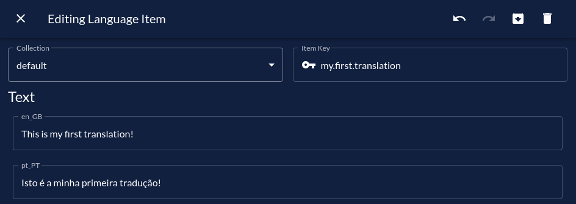
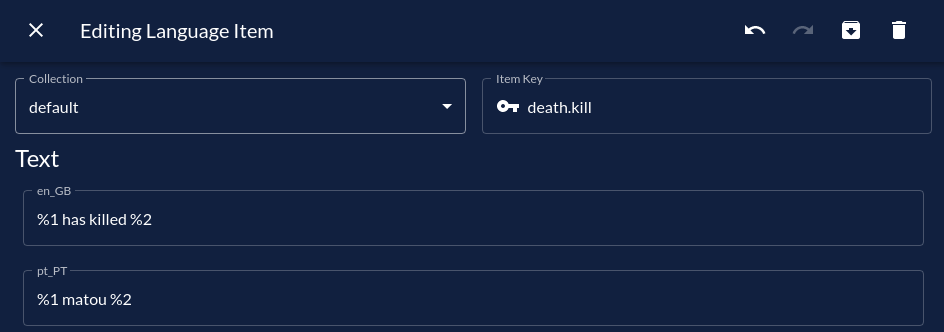
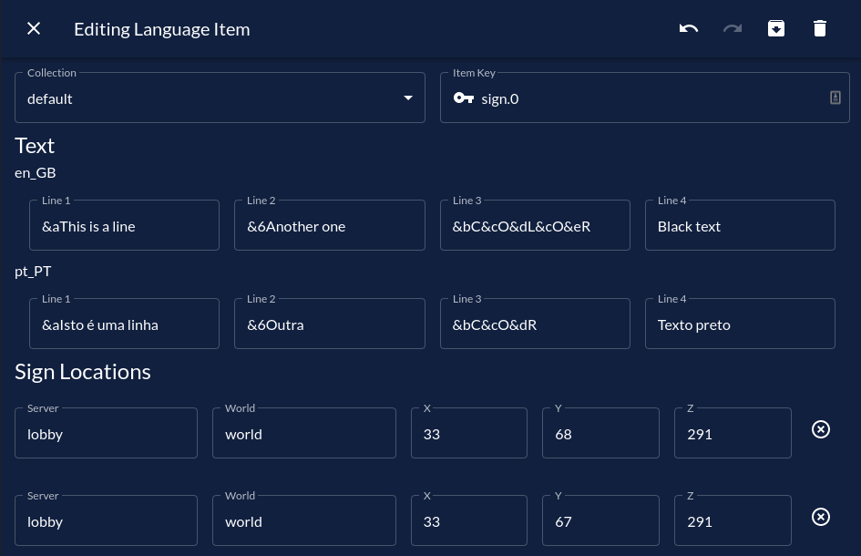

# Translations

[[toc]]

## Introduction

So what is a translation?  
A translation in Triton can be either text or a sign group.
It represents a single message that can be sent in different languages.

If you're using local storage, translations live in the `translations` folder.
Otherwise, they'll live in the `translations` table/collection in your database.

Each translation must be placed inside a collection, which is a group of translations.
Collections provide a better way to organize translations and to apply settings in bulk.

When adding, removing or editing translations, you can manually edit the JSON files or
use TWIN (recommended).

## Managing Collections

Before you can add translations, you must have, at least, one collection.  
Triton generates the `default` collection for you automatically, but you can
rename it or create other collections.

:::: tabs

::: tab TWIN

Creating a collection through TWIN is extremely straight-forward.
Simply click on the "Add Collection" button in the sidebar and type the name for the collection.
Hit "Add" and _bam_, your collection has been created.

:::

::: tab JSON
Each collection is a JSON file in the `translations` folder, so you can create them
simply by creating a new file.

Inside the file, you must initiate an empty JSON array:

```json
[]
```

Alternatively, if you're using BungeeCord, you can initiate the collection with an
alternative syntax:

```json
{
  "metadata": {
    "blacklist": true,
    "servers": []
  },
  "items": [
    ...
  ]
}
```

:::
::::

### Deleting a collection

Deleting a collection is also very easy to do, just follow the instructions
for your preferred method:

:::: tabs
::: tab TWIN
Deleting a collection on TWIN will, by default, move the translations to the default collection.
If you don't want this to happen, consider selecting all the translations inside the collection
and using the "Move to collection" bulk item.

To delete a collection, just click the "Delete collection" button in the sidebar and select the collection you want to delete.
:::
::: tab JSON
Deleting a collection file from the `translations` folder also deletes all translations inside.
Copy them to another collection if this is not the behaviour you want.

To delete a collection, simply delete the corresponding file inside the `translations` folder.
:::
::::

## Managing translations

All translations must have a `key` field.  
For text translations, this field is used in [placeholders](./placeholders.md).  
For sign translations, this field is used in the [sign command](./commands-permissions.md).

### Text Translations

All text translations are required to have the following fields: `type`, `key` and `languages`.
The type field is automatically set on TWIN by selecting the text type.  
Meanwhile, the `languages` field is where you'll define the actual translations for each
language.

::::: tabs
:::: tab TWIN
To add a text translation, click on the "Add item" (`+`) button on the
top right corner while on the dashboard. Then choose _"Text"_ to create a Text Item.

Fill in the information as you wish.

Example:

::::
:::: tab JSON
To add a text translation, simply open the `translations/default.json` file
and add this object (as an example) to the JSON array:

```json{2-3}
{
  "type": "text",
  "key": "my.first.translation",
  "languages": {
    "en_GB": "This is my first translation!",
    "pt_PT": "Isto é a minha primeira tradução!"
  }
}
```

It's important to notice that you must set the type to `text` and provide a `key`.
The `languages` field is a JSON object where the keys are the
[Language ID](./config.md#languages-section) of the corresponding language.

For further reference, this JSON Object will be called **Translatable (Text) Item**.
If this is the first time you opened your `translations/default.json` file, this is how it should look like right now:

```json
[
  {
    "type": "text",
    "key": "my.first.translation",
    "languages": {
      "en_GB": "This is my first translation!",
      "pt_PT": "Isto é a minha primeira tradução!"
    }
  }
]
```

::: tip
To make sure you're using valid JSON, use a JSON parser.
There are hundreds of JSON parsers online, but [here](https://jsonformatter.org/json-pretty-print) is one (completely random one).  
You can also use an IDE like [Visual Studio Code](https://code.visualstudio.com)
:::

If you are not sure how to use the `translations/default.json` file, take a look at these [examples](https://github.com/tritonmc/Triton/tree/v1/examples).
::::
:::::

#### Using variables

Using variables might be useful, for example, if you need to translate a message
like _"Player1 has killed Player2"_ and you want replace _Player1_ and _Player2_
with the actual player names.
To use variables, you must place `%1`, `%2`, `%3`, etc where you want
variables to be inserted. You can also repeat a variable various times if it appears
in the message more than once (e.g. `%1 has killed %2. %1 is awesome!`).

These variables will later be replaced by their actual value passed through the
[Triton Placeholder](./placeholders.md)'s `arg` tag.

Example:
:::: tabs
::: tab TWIN

:::
::: tab JSON

```json
{
  "type": "text",
  "key": "death.kill",
  "languages": {
    "en_GB": "%1 has killed %2",
    "pt_PT": "%1 matou %2"
  }
}
```

:::
::::

#### Using JSON chat components

::: tip REQUIREMENTS
This feature requires Triton v3.1.0 or newer.  
Understanding of the [Minecraft JSON Text Format](https://minecraft.gamepedia.com/Raw_JSON_text_format) is also required.
:::

Since Minecraft 1.7, the game has supported rich text through JSON chat components.
This allows you to add custom click and hover actions as well as natively translated text using Minecraft's own locales.

Because of this, it might be useful to output JSON text in some situations.
To to that, simply prepend `[triton_json]` to the translation text.
You can also place variables in the JSON text, but keep in mind they aren't escaped.

Example:

```
[triton_json]{"translate":"gameMode.changed","color":"gold","bold":true,"with":[{"text":"%1"}]}
```

Right now, there is no TWIN support for this feature, so you have to write the above in the respective language.
In the future, a button to switch between text and JSON modes will be added, which will insert `[triton_json]` automatically.

### Sign Translations

Also known as Sign Groups, these can be used to translate signs.

:::: tabs

::: tab TWIN
Here is an example of a working sign:


:::
::: tab JSON
**Sign Groups** look a bit different. Their type is `sign` instead of `text`.  
Here is an example of a working sign:

```json
{
  "type": "sign",
  "key": "sign.0",
  "lines": {
    "en_GB": ["&aThis is a line", "&6Another one", "&bC&cO&dL&cO&eR", "Black text"],
    "pt_PT": ["&aIsto é uma linha", "&6Outra", "&bC&cO&dR", "Texto preto"]
  },
  "locations": [
    {
      "world": "world",
      "x": 33,
      "y": 68,
      "z": 291
    },
    {
      "world": "world",
      "x": 33,
      "y": 67,
      "z": 291
    }
  ]
}
```

As you can see, its layout is fairly different from Text Translations.  
It still has a `key` parameter that is only used in the `/triton sign` command.

The `lines` parameter is similar to `languages`, but instead of strings, it has a list of 4 strings (the lines of the sign).

Finally, the `locations` parameter holds a list of all the signs in this **Sign Group**.

While you can't provide dynamic arguments to signs directly, you can still have dynamic signs.
Take a look at the [dynamic signs page](./dynamic-signs.md) if you want to translate signs
that have dynamic information (e.g. game join, shops).
:::
::::

## Available Fields for Translatable Items

TWIN abstracts this complexity, but if you want to edit the JSON files manually,
you might need know what each field does.
Here is a full list of supported fields:

### `type`

_required_  
**Type**: String Enum  
**Possible Values**: `text`, `sign`  
This parameter defines the remaining structure of the item.

### `key`

_required_  
**Type**: String  
If `type` is `text`, this will be used to match the in-game placeholders.  
If `type` is `sign`, this will be used to match this **Sign Group** when using `/triton sign`.

### `languages`

_required for `text`_  
**Type**: JSON Object (contains strings)  
**Example**:

```json
{
  "en_GB": "Your text in English here.",
  "pt_PT": "Your text in Portuguese here."
}
```

Holds the text in each language.

### `lines`

_required for `sign`_  
**Type**: JSON Object (contains string arrays)  
**Example**:

```json
{
  "en_GB": ["line1_EN", "line2_EN", "line3_EN", "line4_EN"],
  "pt_PT": ["line1_PT", "line2_PT", "line3_PT", "line4_PT"]
}
```

Holds the sign lines in each language.

### `locations`

_required for `sign`_  
**Type**: JSON Array of Locations  
**Example**:

```json
[
  {
    "world": "world",
    "x": 33,
    "y": 68,
    "z": 291
  },
  {
    "world": "world",
    "x": 33,
    "y": 67,
    "z": 291
  }
]
```

Represents which signs are in this **Sign Group**.

If you're using BungeeCord, you must also include a `server` parameter in each location, like this:

```json
{
  "server": "lobby",
  "world": "world",
  "x": 33,
  "y": 68,
  "z": 291
}
```

### `patterns`

_optional | `text` only_  
**Type**: String (regex) array  
**Default**: `[]`  
If any of the regex strings in this array matches a message (everywhere except scoreboards), it will be replaced with the translation.

### `servers`

_optional | `text` only | BungeeCord only_  
**Type**: String list  
**Default**: empty list  
**Example**: `["lobby-1", "lobby-2", "lobby-3"]`  
If `blacklist` is false, represents the servers where this item is available.  
Otherwise, this represents the servers where this item is **not** available.

### blacklist

_optional | `text` only | BungeeCord only_  
**Type**: Boolean (true or false)  
**Default**: `true`  
If enabled, turns `servers` into a blacklist instead of a whitelist.
