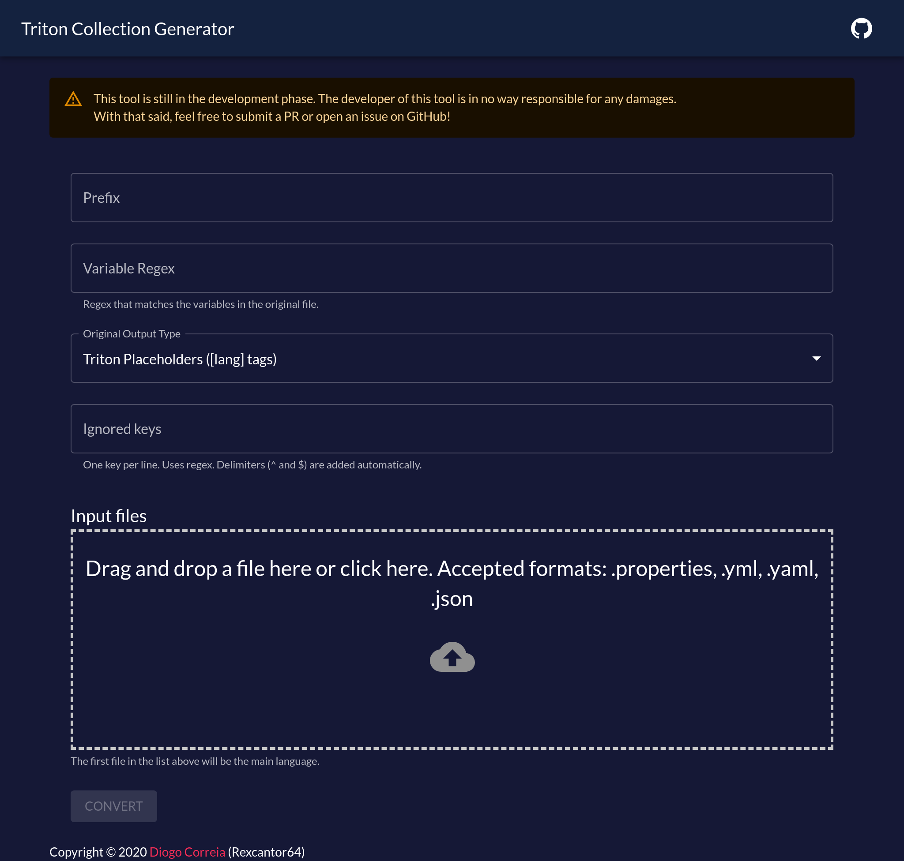

# Bulk translating with the generator tool

## What is the Triton Generator Tool?

The [Triton Generator Tool](https://triton-generator.rexcantor64.com) is a web based tool
that allows you to upload various variants of a configuration files and automatically
generate a collection and the original file but with placeholders.

The tool is completely [open source](https://github.com/tritonmc/triton-collection-generator),
so feel free to contribute.

### Generated collections repository

The community maintains a [repository](https://github.com/tritonmc/triton-translation-collection)
with already generated collections for some plugins.  
Follow the instructions in the README file on how to add them to your server.

If you want to add a new plugin to the list,
[open a PR](https://github.com/tritonmc/triton-translation-collection/compare)
or [request an addition](https://github.com/tritonmc/triton-translation-collection/issues/new/choose).

## Generating your own collections

Open the tool, either on the [official website](https://triton-generator.rexcantor64.com)
or hosted on your machine.

You'll be presented with the following interface:

Here's what everything means:

- **Prefix:** When creating the translations, this will be prepended to the
  item key. If this has `triton.` and the config file has the field `help.menu`,
  the final item key will be `triton.help.menu`. It's recommended to use `pluginName.`.
- **Variable Regex:** The [regex expression](https://regexr.com/) that matches the
  variables in that config file. For example, Essentials uses `{0}`, `{1}`, etc as their
  variables, so you'd put `{\d}` in this field. Other plugins might use `%player%` or similar,
  so that'd be `%\w+%`. Play around with these values to see what works best for you.
  Leave empty if you have no variables.
- **Original Output Type:** You'll most likely want to leave this as default,
  but if you're translating using PlaceholderAPI, you can select the output to use that instead.
- **Ignored Keys:** A list of regex expressions (one per line) that match the keys
  you don't want to be translated. Some plugins have either other configuration or
  content where you can't use placeholders (like signs). You can use this field to tell the generator to ignore these and leave them as they are.
- **Input Files:** The original files to get the translations from.
  The files should be named after the languages they're in. For instance, `en_GB.yml`, `pt_PT.yml`, etc. The file name will be used as a language in the collection file.
  Another important thing to keep in mind is that the first file will be the main language, that is, where the ignored keys will be fetched from.
  Make sure all the files have the same file extension.

After filling in all the information, click the "Convert" button.
Two files will be downloaded to your computer: the collection file (`output.json`)
and the original file with the content replaced by placeholders (`original.<file extension>`).

:::warning
Some browsers, like Chrome, will block multiple downloads from the same site.
Click on "Accept" when the permission request comes up.
:::

## Closing notes

This tool is still in development, and all feedback and contributions are appreciated.  
If you have any issues using this tool, ask for help in our
[Discord server](https://triton.rexcantor64.com/discord).
