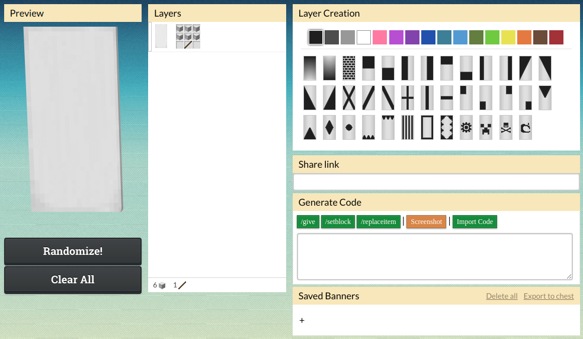
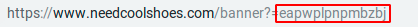

# Generate flag codes

For each language you must set a flag code that'll represent the banner
in the language selection menu.  
To do that, you must either create your own flag or use one of the premade flags below.

## Create your own flag

Start by going to the [Miners Need Cool Shoes' Banner Generator](https://www.needcoolshoes.com/banner).  
When you're there, create your flag.
If you're not sure how you can make your country flag,
just search around the internet and you'll probably find someone that did it already.  

When you're done, get the flag code.
It is appended to the URL when you change the flag.
In this case, the flag code is `eapwplpnpmbzbj` (UK flag).  

## List of premade flags

Here is a list of some premade flags made by other users or the developer.
All of these flags are rotated 90 degrees to accommodate a landscape layout.

- Belgium: `laaEbf`
- Brazil: `calvlvlvetet`
- Canada: `pabjbwpipsbtbEbf`
- China: `balbbBbcbe`
- Croatia: `pabyptmoesplptbt`
- Czech Republic: `pabMpHegeg`
- Finland: `eapbpdpqelel`
- France: `paeEbf`
- Germany: `baayls`
- India: `paetetcscsoyoy`
- Italy: `pacEbf` (dark green) | `pakEbf` (light green)
- Israel `paeyespoet`
- Japan: `pabt`
- Latvia: `bapwpwpwpw`
- Mongolia: `eabEbflG`
- Philippines: `pallpvpcexbIed`
- Palestine: `paaycsbF`
- Portugal: `bacLlt`
- Romania: `laefbE`
- Russia: `eabspy`
- Slovenia: `paeepqpcpfbMel`
- South Korea: `eabrpfpEaGahpi`
- Spain: `padqlElLbybs`
- Switzerland: `bapwplbcbEbf`
- Taiwan: `papmeceGeHeLelevbLbwbHbH`
- United Kingdom: `eapwplpnpmbzbj`
- United States of America (USA): `bapBeC`
- Ukraine: `paeqlL` | Ukraine & Heart: `paeqlLbtbveFeF`
- Vietnam: `labwlobElvbgbf`
- Venezuela: `eapobsly`

If you'd like to add a flag to this list,
click the `Improve this page` button below.
