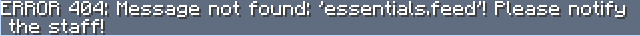

import InfoCard from '../../components/InfoCard.js';

# How to get your first message translated

_Make sure you've read **[Placeholders](~/docs/placeholders)** before continuing._

## What can be translated?

Triton can detect placeholders on any kind of text, including chat, action bars, title/subtitles, scoreboards, bossbars, etc.
However, it _only_ detects the placeholders, so you must be able to change the text in whatever plugin you want to translate.

In this page, I'm going to use [EssentialsX](https://www.spigotmc.org/resources/essentialsx.9089/) as an example.

## Replacing text with placeholders in the plugin's config

In this section we're going to go into EssentialsX's locale files and change one of the messages to a placeholder.

<InfoCard>

For some reason, EssentialsX doesn't allow you to change their messages out of the box, so you
need to go to their
[GitHub](https://github.com/EssentialsX/Essentials/blob/2.x/Essentials/src/messages.properties),
grab the file and place it into your `plugins/Essentials` folder.

</InfoCard>

For the following steps, it is recommended to use a proper text editor like [Nodepad++](https://notepad-plus-plus.org/) or [VSCode (recommended)](https://code.visualstudio.com/). Both are free and easy to setup.

Open EssentialX's `messages.properties` and look for the line starting with `feed=`. It should look like this:

```
feed=\u00a76Your appetite was sated.
```

To make it translatable by Triton, we just need to replace it with a placeholder. Change the line to this:

```
feed=[lang]essentials.feed[/lang]
```

That's it!

**PRO TIP:** You can change `essentials.feed` to whatever you want, it just needs to match what you're going to configure in Triton in the next step.

If you type `/feed` in-game, it should display an error message like this:



This happens because we haven't setup Triton yet.
After setting this up, everything should work as expected.

## Setting up the message in Triton

There are two ways to add a message to triton:

#### Using TWIN (recommended)

_Make sure to [read the docs](~/docs/twin) about TWIN first._

1. Open TWIN and click the "+" button to create a new message.
2. Select Text.
3. In the item key put `essentials.feed`.
4. Fill in the **Text** section however you like.
5. Save and execute the provided command ingame.

#### Using the translations folder

_Make sure to [read the docs](~/docs/placeholders) about placeholders first._

1. Open `translations/default.json`
2. Add the following item:

```json
{
    "type": "text",
    "key": "essentials.feed",
    "languages": [
        "en_GB": "&6Your appetite was sated.",
        "pt_PT": "&6O teu apetite foi saciado."
    ]
}
```

Save the file and reload the plugin.

### Using an advanced placeholder

Using an advanced placeholder is pretty similar. Just make sure you pass the arguments in the placeholder.  
Going back to the EssentialsX example, we're going to translate the `addedToAccount` message.

This is the placeholder that we should put in `messages.properties`:

```
addedToAccount=[lang]essentials.addedToAccount[args][arg]{0}[/arg][/args][/lang]
```

To configure it in Triton, just do the same thing as before.
To use the argument, just place `%1` in any of the messages and it will be replaced by the argument provided in the placeholder.
