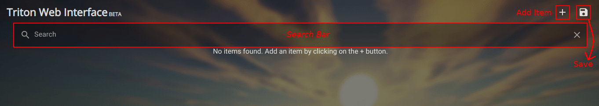
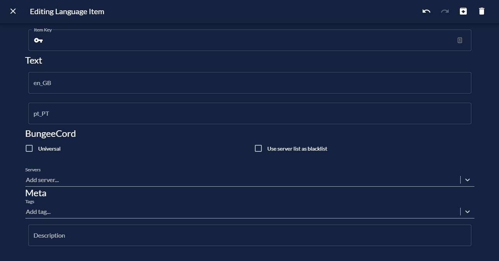

# TWIN

**TWIN** stands for **T**​riton **W**​eb **In**​terface.  
Its goal is you help you manage your `languages.json` file easily.

## Get your TWIN token

To get started, you first need to get your TWIN token. There are two ways to get it: using Discord or by sending me a PM on Spigot.

### Using Discord

This is by far the fastest and most efficient way to get your TWIN token. Here is what you need to do:

1. [Join our Discord if you haven't already](/discord).
2. Go to the `#verification` channel.
3. Write your Spigot username in the chat.
4. You should receive a message from the bot saying that your account has been verified.
5. Finally, reply `!twin` to the bot to get the token.

### Sending me a PM

This is really straightforward, but it takes longer than the previous method. I might take a few hours or even days before I reply.  
Just send me a PM on Spigot asking for your TWIN token.

## Using TWIN

To open your config on TWIN, type `/twin` in-game or on your console.

When you open TWIN for the first time, this is what you might see:

You will be presented with a search bar, an add button and a save button. There are also undo and redo buttons, but those are hidden until they are available.  
If you have any language items, you'll also see those on the page. If not, a message saying `No items found` will show up (like above).

### Adding/Removing a Language Item

To add an item, simply click the `+` button and select either Text or Sign. You'll be presented with a screen like this:

I've already explained what each of those fields does in the [placeholders page](~/docs/placeholders), so check it out if you haven't already.

To remove an item, simply click the `DELETE` button in the editing screen. If you've deleted an item by accident, simply click the undo button.

### Saving

To save, simply click the `SAVE` button in the top right of your screen. Follow the instructions on-screen to apply the changes to your server. To save bandwidth, only the changes are sent to your server, not the whole file.
